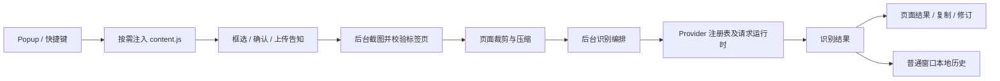

## Context

动机见 `proposal.md`。现状依据为 2026-09-05 工作区、CodeGraph 结构查询，以及现有入口、运行模块、配置与测试的定向读取。CodeGraph 返回 30 个索引文件，嵌套闭包和部分子目录信息有限；本设计用已识别文件补足这些边界，不将索引数量视为仓库文件总量。

现有主流程：



| 现有区域 | 已有职责 | 规划关注点 |
|---|---|---|
| `background.js`，394 行 | 安装迁移、消息 handlers、截图、识别、历史、快捷键 | 入口保留组装与监听，用例可单测 |
| `background-message-router.js` | handler 注册及异常兜底 | 保留；不重做已经存在的路由 |
| `providers/registry.js`、`providers/runtime.js` | 配置标准化、路由、七类请求、百度 token 缓存 | 分离各服务实现，共享请求策略 |
| `content.js`，1839 行 | DOM 生命周期、选区、确认、告知、裁剪编排、结果与取消 | 建立单一会话所有者后再拆 UI |
| `options.js`，1085 行；`popup.js`，524 行 | 配置表单/导入导出；启动/历史界面 | 保留已存在的 `options/runtime.js`、`popup/runtime.js` 纯 helper |
| 根目录公共模块 | 配置、历史、网络、i18n、截图工具 | 本轮保持路径，按实际复用关系依赖 |
| 验证与发布 | Node、ESLint、局部 checkJs、Mock Chromium、ZIP 白名单 | ESLint 当前扫描到独立银行卡项目，先修正范围 |

旧 `docs/improvement-checklist.md` 的完成记录保留为历史。它明确将大型 DOM 闭包作为边界例外；本方案通过实例化会话和显式销毁处理当时的风险，属于后续维护规划。

## Goals / Non-Goals

**Goals:**

- 架构审阅已确认保留五阶段主动重构，以职责清晰和后续可维护性为目标；当前没有明确痛点，不将文件较长直接等同于实现缺陷。
- 根入口负责启动与组装，每个状态只有一个所有者；公共纯函数可在 Node 中验证。
- 用户操作、消息 action、响应形状、Provider ID、存储结构与导出兼容保持稳定。
- 每一阶段都能独立通过门禁和回退，允许阶段之间保持可用版本。

**Non-Goals:**

- 本轮不引入框架、打包构建、全量 TypeScript、全局状态总线或通用插件平台。
- 不以固定行数作为验收；不将已有稳定公共模块全部搬入 `shared/`。
- 不变更模型、接口、权限、首次告知政策或请求超时语义。

## Decisions

### 1. 保留浏览器入口，按运行上下文组织模块

目标结构如下。标注为“新增”的目录与文件尚未实施；原有公共模块位置保持稳定。五阶段范围保留，具体文件按职责边界落地；入口与 controller 若只有一次转发且没有独立状态、编排或生命周期职责，可合并并记录理由，不以文件数量作为验收目标。

```text
manifest.json
background.js                  # 保留：初始化和依赖组装
background/                    # 新增
  message-handlers.js           # action 到用例，兼容原响应形状
  capture-service.js            # 标签页校验与截图
  recognition-service.js        # 配置、取消、Provider、历史编排
content.js                     # 保留：注入幂等和启动
content/
  styles.js                    # 已有
  session.js                   # 新增：会话、请求和销毁所有权
  selection.js                 # 新增：选区交互及几何状态
  capture-pipeline.js           # 新增：隐藏 UI、截图、裁剪、发送
  result-view.js                # 新增：展示、复制与修订
  notice-view.js                # 新增：告知、进度、错误提示
providers/
  registry.js                  # 已有：保持对外接口
  runtime.js                   # 过渡兼容入口，迁移完成再清理
  transport.js                 # 新增：请求封装、错误映射与共享构造
  claude.js / openai.js         # 新增：独立服务实现
  baidu.js / aliyun.js / zhipu.js
  openai-compatible.js / custom.js
options.js                     # 保留：页面启动
options/
  runtime.js                   # 已有纯 helper
  controller.js                # 新增：表单状态和事件订阅
  provider-form.js              # 新增：Provider 字段与校验展示
  config-transfer.js            # 新增：导入预览、迁移和脱敏导出
popup.js                       # 保留：页面启动
popup/
  runtime.js                   # 已有纯 helper
  controller.js                # 新增：捕获入口和历史订阅
  history-view.js               # 新增：列表/搜索/复制/导出
provider-config.js / history-store.js / request-runtime.js
background-core.js / background-message-router.js
capture-utils.js / extension-runtime.js / i18n-runtime.js
options.html / popup.html / *.css / _locales/ / icons/
tests/ / scripts/ / docs/ / openspec/
```

采用现有工厂/命名空间兼容模式：浏览器显式加载，Node 可使用导出测试。仅工厂 API 暴露在命名空间中；实例状态封装于闭包。相比整体搬到 `src/`，此方式减少 manifest、测试和源码加载路径同时变动。

### 2. 状态由实例管理，通过参数和回调传递

| 状态 | 唯一所有者 | 依赖/约束 |
|---|---|---|
| 当前选区、会话 ID、活动请求 ID | `content/session.js` 创建的实例 | 视图调用命令；异步边界检查会话仍有效 |
| AbortController 注册表 | 后台 recognition service 实例 | 重用 background-core 工具；取消按 requestId |
| 历史串行写入队列 | `history-store.js` 实例 | 保持取消补偿与保存失败警告语义 |
| 百度 token 缓存 | 百度适配器实例 | 只存后台内存，重启可重新获取 |
| 配置迁移 | `provider-config.js` | 保留共享 Promise、现代字段优先及读回验证 |
| 表单草稿、保存状态 | Options controller 实例 | UI 使用表单接口，存储转换仍归 provider-config |

拟议工厂契约为 `createSession({ runtime, view, capture, createRequestId })`，返回 `start()`、`cancel()`、`destroy()`。销毁幂等，移除监听、清除计时器、关闭 UI，并使过期回调失效。工厂参数注入依赖，不让子视图直接写会话变量。

已确认每个标签页同一时间只有一个有效识别会话。新会话开始时结束该标签页的旧会话：使旧标识失效、取消尚在执行的请求、清理旧会话 UI 和监听；迟到的旧结果不能覆盖新会话。会话隔离范围是标签页，不引入整个扩展共用的单任务锁；一个标签页的取消不能结束另一个标签页的会话。

依赖方向：入口 → controller/service → 纯 helper 或平台适配器。Provider 不导入页面、历史或 Options；历史存储不依赖 Provider；视图不持有凭据。相比拆出多个共享可变全局对象，此方式让重复注入、快速取消和页面卸载具有明确清理路径。

### 3. 先冻结边界契约，再做行为保持迁移

- 消息 action 保留：`captureVisibleTab`、`performOCR`、`cancelOCR`、`testAPI`、`getContentPreferences`、`getUploadNoticeState`、`acknowledgeUploadNotice`、`updateHistoryRecord`、`listHistory`、`deleteHistoryRecord`、`clearHistory`，以及向页面发送的 `startCapture`。
- 暂不统一历史响应、截图响应和识别响应的不同形状；调用方无须同时升级。
- Provider 保留 `normalizeConfig`、`recognize`、`interpretConnectionError` 接口，所有网络路径继续走公共策略。27000 毫秒是一次请求策略调用的预算，不新增整条识别流水线总超时。
- 服务商由用户手动选择；一次识别及其自动重试使用该次选定的服务商，失败显示原因，由用户决定重试或切换。不引入跨服务商自动回退，避免将截图发送给未为该次识别选择的服务商。
- 保留 `apiProvider`、`apiConfigs`、`language`、`prompt`、`theme`、`uiLanguage`、`ocrHistory`、`uploadNoticeAcknowledgedVersion` 等现有字段及 Provider 存储映射；本轮无存储 schema 迁移。
- 配置和历史继续存于本机，不加入账号或云同步。设置页负责配置表单、校验和导入导出，转换与迁移复用 provider-config；后台统一处理历史读取、新增、修订和删除，页面及 Popup 通过消息访问历史，history-store 负责串行写入与 50 条上限。第三方识别请求仍按用户所选服务商发送截图，本机存储决策不改变这条数据流。
- 已有行为用六组主规格对照；本重构的 delta specs 跳过。真实功能差异另立变更。

### 4. 每次迁移同步脚本加载和交付边界

- 已确认本轮保留原生 JavaScript、零构建加载及现有测试/打包流程；模块化沿用明确的脚本加载顺序，框架、全量 TypeScript 与构建工具另行评估。
- 后台：公共工具 → Provider transport/实现/registry → 后台 services → `background.js` 组装。
- Content：i18n/截图工具/样式 → 视图/选区/pipeline → session → `content.js`；统一由 `CONTENT_SCRIPT_FILES` 决定顺序。
- Options/Popup：HTML 中先纯 helper、再视图/controller、最后入口。
- 新模块同时登记 ESLint globals（仅必要公开 API）、局部 checkJs、静态加载检查与生产白名单。
- 首阶段限定 ESLint 的 OCR 范围，并让 E2E 临时副本复用生产文件集合；现在该副本复制过滤器没有排除独立银行卡项目或 OpenSpec 文档。打包白名单原本已隔离这些内容。
- 相比立即切换 ESM/构建工具，保留现有脚本体系可将兼容问题控制在各批次中。

## Risks / Trade-offs

- [会话拆分破坏取消/遮罩隐藏时序] → 先测快速取消、重复启动、迟到结果、截图帧时序，再迁移一个模块。
- [模块加载顺序或 ZIP 漏文件] → 同步静态依赖检查、打包测试及解压加载冒烟。
- [Provider 分离改变 payload/鉴权/百度缓存] → 沿用请求契约测试，补齐差异；真实服务商连通性单独记录。
- [现有 E2E 临时 manifest 放宽 host_permissions] → 自动测试仅证明 Mock 流程；生产权限仍需真实浏览器手工冒烟。
- [checkJs 只覆盖五个文件] → 每阶段增加相应纯模块的类型检查，不能把现状称为全量类型安全。
- [已有规格由实现补录] → Evidence 指向验证文件；未自动覆盖的边界标为待验收，补基线不表示重新验证了全部产品行为。

## Migration Plan

| 阶段 | 工作范围 | 完成门禁 |
|---|---|---|
| 1：基线与隔离 | ESLint/E2E 副本范围、消息响应和生命周期特征测试 | 普通 `npm run check` 能在当前混合工作区通过 |
| 2：后台与 Provider | 后台 services、Provider 实现、装配兼容 | 契约测试、完整 check、package |
| 3：页面会话 | 单一 session 所有权后逐步迁移选区/pipeline/视图 | 取消、迟到响应、重复注入、裁剪及结果 E2E |
| 4：设置与 Popup | controller、表单、配置迁移/导出边界、历史视图 | 配置兼容、脱敏、历史操作、i18n/主题回归 |
| 5：交付收尾 | 补映射、删除过渡桥、生产包与浏览器冒烟 | check、package、解压加载，记录人工结果 |

执行顺序固定为 1 → 2 → 3 → 4 → 5。每阶段完成并记录门禁后再进入下一阶段。发布或提交按后续任务授权处理。

审阅决策是迁移的验收约束，不代表对应行为已在本轮重新验证。阶段 1 先核对现有实现与这些边界；若发现真实用户行为差异，记录差异并按 proposal 另立行为变更，不能将其静默并入 `skip_specs` 的纯重构。

回退以阶段为单位恢复已审阅的代码与对应加载/打包映射，不重置整个工作区，不覆盖无关目录。本轮不迁移持久化数据，旧包继续读取相同结构；尚未通过阶段留在当前 change，全部实施并验收后才 archive。

## Open Questions

- Chrome/Edge 真实浏览器版本和商店权限冒烟环境在阶段 5 记录；当前 Chromium Mock 测试不覆盖 Edge 与真实服务商可用性。

## 验收范围更新（2026-09-06）

用户明确取消本次 Edge 验收；阶段 5.3 仅要求 Chrome 生产 manifest 验收。Edge 未验收，不作为本次归档门禁，也不宣称兼容性已通过。其余 Chrome 验收要求保持。
